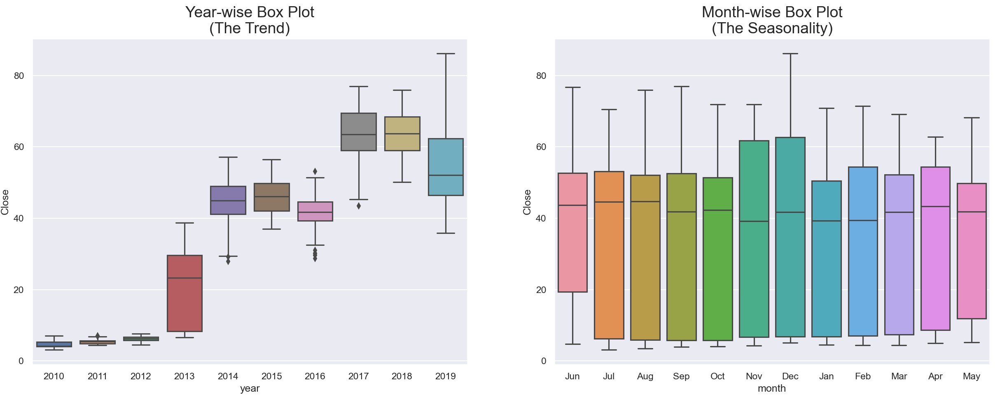
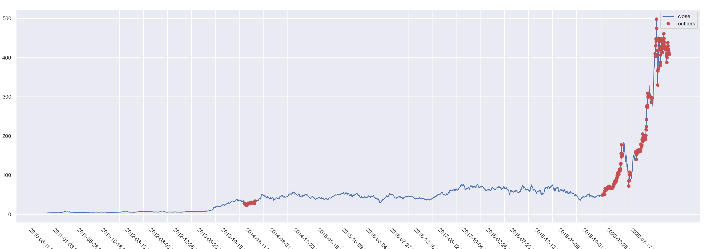

# Tesla Stock Price Prediction

## Data Analysis 

### Analyze *Close* price with *Date​*

As our goal is to predict the stock *close* price, we decide to analyze the features of *close* variable first.

> The following plots implemented in “full_data_outliers.ipynb”

### Moving Average and Smooth

To reduce the effect of noise and have a better understanding of underlying trend, we may use moving average and smooth to visualize the data. 

- Moving average with rolling = 7, 15, 30 respectively 

​		We could see the moving average is highly similar to the original data. 

- Smooth 

​		The overall trend is increasing and for each method, in year 2020, there is a sharp increase and the trend in the previous year might not be appropriate to predict the stock price in 2020. So we determine to further examine this problem.

#### Correlation 

For time series data, it has high probability of correlation in itself. So we get the *Close* price after shifting $x$ days, denoted as $Close_x$. And plot $Close_x$ vs. $Close$ to see if there is correlation. 

Observe that at the previous years, the data has more correlation. While the latest few years the data scatter more. No obvious difference when using different $x$ days. 

And we use ACF plot to see 

> TODO

 

Combine with the moving average, we get the plot and the correlated score is calculated through method pearson : standard correlation coefficient

Observe that the *Close* price is highly correlated to other effects 

### Year Trend and Seasonality

From the plot, we could cearly observe that year 2020 has extremely different values compared to other years. We exclude year 2020 to see the trend.

It clearly shows the previous outliers in the month-wise plot is caused by year 2020 and no seasonality exists. Also, the year-wise plot suggests that no cyclic relation exists, and it might be better to use only year 2020 data to predict the stock price. 

### Outliers

To observe the outliers, we decide to use all of the previous introduced variables (moving average and shifted close values) and use K-means cluster to fit a simple model. We decide to choose among `n_cluster=range(1,30)` and use the score to choose the number. 

> we do not want to use these models as a fit model, just to analyze the data. So no checking for any assumptions as a Machine learning manner. 

So we choose number=10 and observe the outliers, where we define the points' $|distance|$ is in the largest $10\%$ as outlier. $distance=predict-observed \ value$

Nearly all of the points in year 2020 are considered as outliers, so year 2020 might be better not to predicted using all of the data. 

Where the same situations for 

- IsolationForest

- OneClassSVM

- EllipticEnvelope

Therefore, we decide to analyze year 2020 only 

> The following plots implemented in “2020_data_outliers.ipynb”