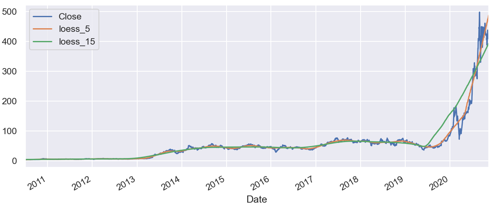
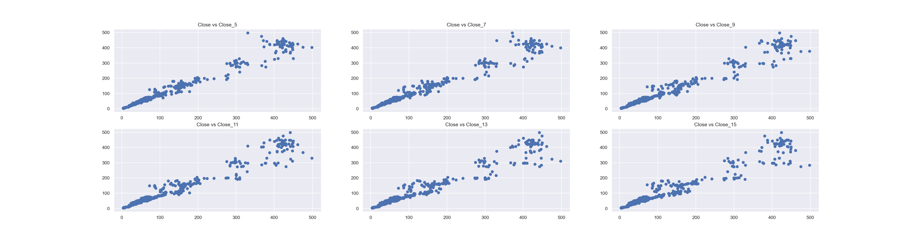
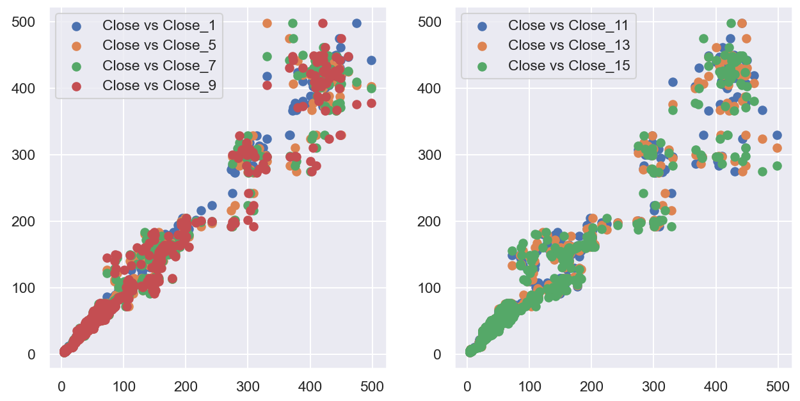
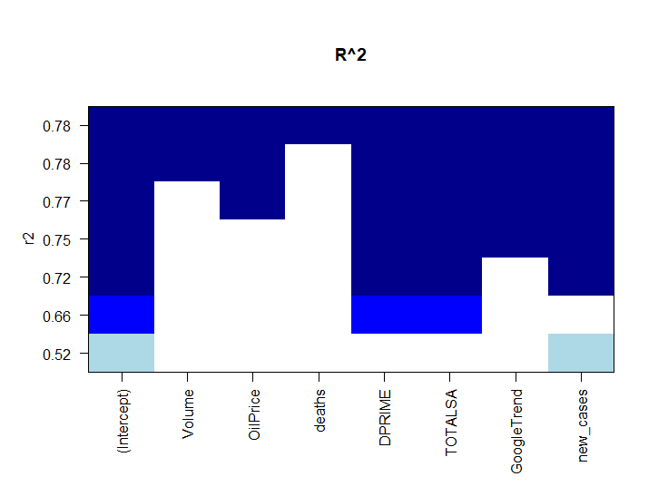
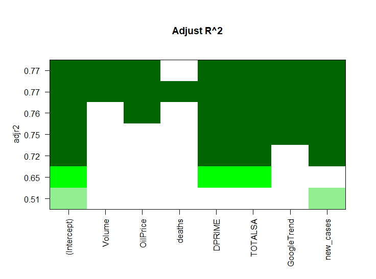
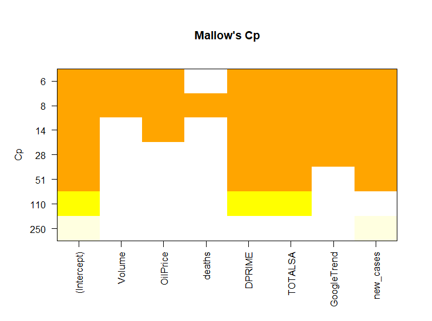
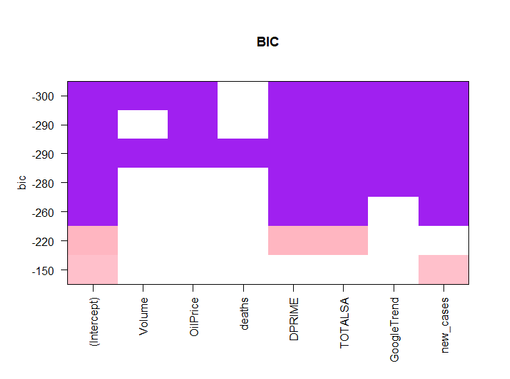
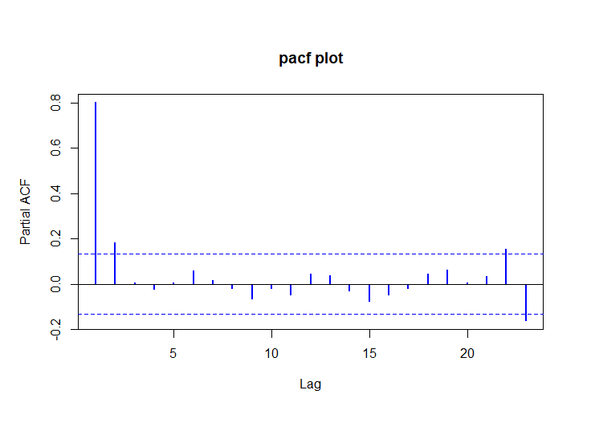
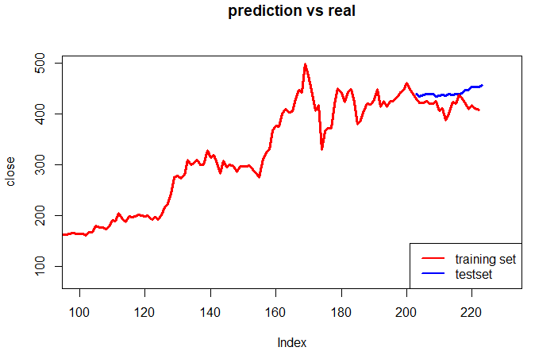
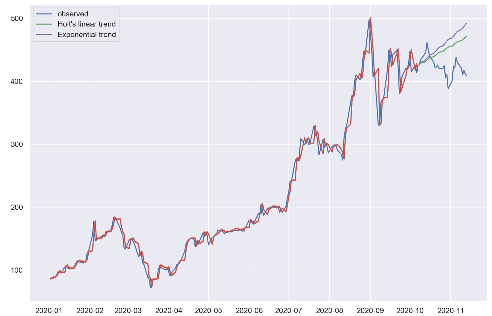

# IMPORTANT NOTE 

- This is the project of course *VE406, apply linear regression using R*, offered in UM-SJTU JI in 2020Fall. Professor Tong, Zhu.
- The project mainly focus on analysis procedure, but not final model training/test accuracy. So no popular machine learning algorithm (for regression root requirement). 
- **Goal**: Predict Tesla Stock Price during 2020-12-07 — 2020-12-11. No long term prediction accuracy considered. 
- **Quick overview:** see poster in *./Poster* 
- **Honor Code:** If there is similar project in the future, it is the responsibility of JI students not to copy or modify these codes, or TeX files because it is against the Honor Code. The owner of this repository dosen't take any commitment for other's faults.

 

# VE406 PROJECT - Tesla Stock Price Prediction

 Boqun Li, Shensong Zhao, Xinmiao Yu

# Source Code Usage

**The final model is in Final.R** 

**The analysis procedure is in Folder : ./Analysis/**


This code is used to predict the closing prices of TESLA from 2020.12.7 to 2020.12.11. 	

To use the code, you need to **set** the work directory where you need to place your output. After run all the code you will get

a text file contains the close price of TESLA from 2020.12.7 to 2020.12.11, separated by a new line character.


# Tesla Stock Price Prediction

The whole project following the flow chart. Our final model is **AR** model. 

## Analyze *Close* Price with *Date​* as a Univariate Time Series

As our goal is to predict the stock *close* price, we decide to analyze the features of *close* variable first.

> The following plots implemented in “/Analysis/full_data_outliers.ipynb”

### Moving Average and Smooth

To reduce the effect of noise and have a better understanding of underlying trend, we may use moving average and smooth to visualize the data. 

- Moving average with rolling = 7, 15, 30 respectively 


​		We could see the moving average is highly similar to the original data. 

- Smooth 

  LOESS: Locally Weighted Scatterplot Smoothing.  The algorithm works by estimating the smooth y_i by taking the frac*N closest points to (x_i,y_i) based on their x values and estimating y_i using a weighted linear regression.

  https://www.statsmodels.org/stable/generated/statsmodels.nonparametric.smoothers_lowess.lowess.html



​		The overall trend is increasing and for each method, in year 2020, there is a sharp increase and the trend in the previous year might not be appropriate to predict the stock price in 2020. So we determine to further examine this problem.


#### Correlation 

For time series data, it has high probability of correlation in itself. So we get the *Close* price after shifting $x$ days, denoted as $Close_x$. And plot $Close_x$ vs. $Close$ to see if there is correlation. 



Observe that at the previous years, the data has more correlation. While the latest few years the data scatter more. No obvious difference when using different $x$ days. 



Combine with the moving average, we get the plot and the correlated score is calculated through method pearson : standard correlation coefficient


Observe that the *Close* price is highly correlated to other effects 


### Year Trend and Seasonality


From the plot, we could cearly observe that year 2020 has extremely different values compared to other years. We exclude year 2020 to see the trend.


It clearly shows the previous outliers in the month-wise plot is caused by year 2020 and no seasonality exists. Also, the year-wise plot suggests that no cyclic relation exists, and it might be better to use only year 2020 data to predict the stock price. 


### Outliers

To observe the outliers, we decide to use all of the previous introduced variables (moving average and shifted close values) and use K-means cluster to fit a simple model. We decide to choose among `n_cluster=range(1,30)` and use the score to choose the number. 

> we do not want to use these models as a fit model, just to analyze the data. So no checking for any assumptions as a Machine learning manner. 


So we choose number=10 and observe the outliers, where we define the points' $|distance|$ is in the largest $10\%$ as outlier. $distance=predict-observed \ value$


Nearly all of the points in year 2020 are considered as outliers, so year 2020 might be better not to predicted using all of the data. 

> The following plots implemented in “2020_data_outliers.ipynb”

**Year 2020 Data Decomposition**


## Data collecting

- Search and Choose possibly useful data

  We intend to choose data from different categories, to prevent data used repeatedly. However, there must exhibt correlation among collected data. 

- 

### Collected Data Analysis

- **Correlation between predictors**. We use $Pearson$ correlation to measure the correlation between predictors 

  

  - correlation = 1 for *Open*, *High*, *Low* prices, as expected.
  
  This predictors correlated problem will be discussed later. 
  
- **Collected data as time series**. The predictor itself could be considered as time series. We need to examine its properties and discuss potential issue of using time series to predict a time series.


## MLR Analysis

First we decide to use muti-linear regression to find which variable is related to the close price

 

 

From the mlr model we can see that the OilPrice , DPRIME, TOTALSA , GoogleTrend, new_cases are relevant


           


## Problem Addressing

### Monthly Data

Here for the data DPIME and TOTALSA, they are both collected on a monthly basis. Hence for a certain time period, these two parameters will be the same.


Here we want to fit mutilple catogories of data. We notice that for the TOTALSA and DPRIME, these two data are only recorded monthly. However, for our stock price or oil price, the data is collected daily. Hence we would have same TOTALSA and DPRIME for certain stock closing price.

To solve this problem, Generalized Linear Mixed Model(GLMM) is used. The two variables will be taken as random effect, the others taken as the fixed effect. The random effect is assumed to only affect the intercept of the model.

Then we try to compare among these models to decide which model is the best one. We use anova table and compare AIC and BIC among these models.

```R
Data: data.frame(tesla.training)
Models:
tesla.TOTALSA: Close ~ OilPrice + GoogleTrend + new_cases + (1 | TOTALSA)
tesla.DPRIME: Close ~ OilPrice + GoogleTrend + new_cases + (1 | DPRIME)
tesla.glmm: Close ~ OilPrice + GoogleTrend + new_cases + (1 | DPRIME) + (1 | 
tesla.glmm:     TOTALSA)
              npar    AIC    BIC  logLik deviance  Chisq Df Pr(>Chisq)    
tesla.TOTALSA    6 1968.4 1988.2  -978.2   1956.4                         
tesla.DPRIME     6 2329.4 2349.3 -1158.7   2317.4   0.00  0               
tesla.glmm       7 1970.4 1993.5  -978.2   1956.4 361.04  1  < 2.2e-16 ***
---
Signif. codes:  0 ‘***’ 0.001 ‘**’ 0.01 ‘*’ 0.05 ‘.’ 0.1 ‘ ’ 1
```

The AIC and BIC for the first model is the smallest, then we further check the summary of the model fitted only with TOTALSA.

```R
Formula: Close ~ OilPrice + GoogleTrend + new_cases + (1 | TOTALSA)
   Data: data.frame(tesla.training)

REML criterion at convergence: 1963.4

Scaled residuals: 
    Min      1Q  Median      3Q     Max 
-3.2321 -0.4571  0.0706  0.5182  4.3036 

Random effects:
 Groups   Name        Variance Std.Dev.
 TOTALSA  (Intercept) 15105.5  122.90  
 Residual               711.9   26.68  
Number of obs: 202, groups:  TOTALSA, 10

Fixed effects:
             Estimate Std. Error t value
(Intercept) 1.298e+02  4.520e+01   2.870
OilPrice    1.360e+00  4.106e-01   3.313
GoogleTrend 7.110e-01  1.594e-01   4.460
new_cases   3.365e-04  3.193e-04   1.054

Correlation of Fixed Effects:
            (Intr) OilPrc GglTrn
OilPrice    -0.409              
GoogleTrend -0.231 -0.018       
new_cases   -0.302  0.197  0.173
```

Finally we will make predictions based on the tesing dataset. We compare the predicted prices with the real stock closing prices and evaluate the model.


### Collinearity

> implemented in pca_analysis.Rmd

  In this part, we mainly want to address the problem of collinearity among the regressors.
The method we use is Principal Component Analysis.

  Firstly, we will load the data into R. We discard the column of Date since it has character symbols. Adj.Close is discarded because it is the same as the closing price. While deaths column has too many zeroes which is not good for selecting regressors.

  Here we conduct PCA analysis using prcomp() function. Before we conduct, we need to scale and center all the data to the same order of magnitudes.

  Then we want to analyze the result of PCA. First of all, we draw the line graph to show how much proportion of variance does each principal component explain. Besides, we also show the numeric value for the cumulative proportion of variance explained by PCA components. Therefore, we pick the first four principal components that explain 92.05% variance, which is enough for our model.

  Furthermore, we show the coefficients of each variable in each PCA component. In case we need it to establish the formula for predicting.


```R
Importance of components:
                          PC1    PC2    PC3    PC4     PC5     PC6
Standard deviation     2.2719 1.7868 1.1550 0.6609 0.59955 0.50071
Proportion of Variance 0.4692 0.2903 0.1213 0.0397 0.03268 0.02279
Cumulative Proportion  0.4692 0.7595 0.8808 0.9205 0.95313 0.97593
                           PC7     PC8     PC9    PC10    PC11
Standard deviation     0.42512 0.28016 0.05867 0.04045 0.02259
Proportion of Variance 0.01643 0.00714 0.00031 0.00015 0.00005
Cumulative Proportion  0.99236 0.99949 0.99980 0.99995 1.00000
```

Since we have decided to use the first 4 components, then we want to find out the improvement it brings to the collinearity problem.

First we will conduct an overall independence check among the four principal components. We plot the pair plot to see whether there is still relationship in them. On the diagnol we plot histogram to have more information on the components. The upper and lower panels are symmetric and are the scattered plots.


Also we show the correlation matrix,

```R
[,1] [,2] [,3] [,4]
[1,]    1    0    0    0
[2,]    0    1    0    0
[3,]    0    0    1    0
[4,]    0    0    0    1

n= 222 


P
     [,1] [,2] [,3] [,4]
[1,]       1    1    1  
[2,]  1         1    1  
[3,]  1    1         1  
[4,]  1    1    1      
```

From the covariance matrix, we know that PCA can solve the collinearity problem to a large extent. And the plot also shows that PCA components are fairly independent since there is no significant trend in the plots.


### Time Series

#### AR

The residuals shows that the errors are correlated. so we seek AR model for help.  The ar model could solve the corelated errors


The model we used is AR(10) and then we can construct the final model of the price using AR model.


by splitting the data set to two parts, and we use the first part as the training set, we can get the sum of squared error which is

5089.507.

#### ARIMA Model

First we need the time series to be stationary,  so we take the log of the close price 

   

for the log price, we need first find the order of the AR model. From the acf plot we know that after lag = 10, the residuals will have a low correlation so we tried AR(10) and use the command arima(10, 1, 0) to get the lowest AIC. 

Then we add the other variables into the model so that we can call 

```
model = arima(TSLA.full$Close,xreg = cbind(o = TSLA.full$OilPrice, d = TSLA.full$DPRIME, t = TSLA.full$TOTALSA, g = TSLA.full$GoogleTrend, n = TSLA.full$new_cases),order = c(10,1,0))
> model$coef

 ar1           ar2           ar3           ar4           ar5           ar6 
-7.738127e-02  6.574786e-02  1.122720e-01 -3.452755e-02 -1.751326e-01 -8.941308e-02 
          ar7           ar8           ar9          ar10             o             d 
 2.723178e-02 -8.678006e-03  6.391469e-02  1.386772e-01  7.159843e-01 -4.345113e-01 
            t             g             n 
-4.034938e+01  2.014916e-01  9.451161e-05
```


p = 2 is enough and the prediction for close price is shown in the figure below

We know that all the variables we used are time series so we may use VAR model in case that the variables are not correlated 

#### VAR MODEL


After GARCH model we can see that the variance of the errors will come close to a constant, however, the prediction is a straight line so we will not give the prediction for the GARCH model


We can use the pacf plot to find the order of the GARCH model

The residuals of the mean model of a time series is , The ARCH model is used to solve the heteroscedasticity of the time series. Though we solved correlated errors, the variance of the residuals is still not a constant.

#### GARCH Model

The total square error is 16094.49.

By splitting the data we used in the model to two parts, the training set and the test set, we can predict the value for the next few days after the training set, and the result is shown in the figure.




the model can be written as

  From the diagnose plot we know that the model is reasonable except that there exists heteroskedasticity in the residuals

  

 

we can get the residual plot shown below.


> in analysis.ipynb

**Exponential**

Specifically, past observations are weighted with a geometrically decreasing ratio.

#### Simple Exponential Smoothing (SES)

The method is suitable for univariate time series without trend and seasonal components. 


score:

fit1: 6701.632437495861

fit2: 6573.91041630164

fit3: 6537.613494767057

#### Holt’s Method



linear: 34673.692281152245

Exponential: 59450.00678899398


#### Holt-Winter (HWES)

With a constant seasonality component along with an increasing trend, we may try  **Holt-Winter additive model** 


Train test spilt with  training set and 20 test set 

1: 20779.479557174884

2: 15185.219213036527

#### SARIMA


1: 30738.298243798577


## Model Comparison 


