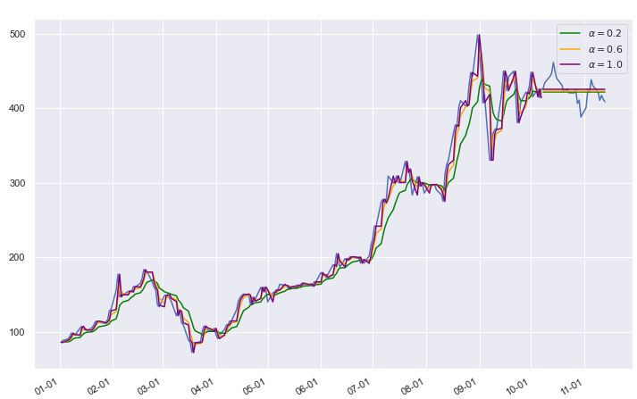

# Tesla Stock Price Prediction


## Pre-Data Analysis

### Analyze *Close* Price with *Date​* as a Univariate Time Series

As our goal is to predict the stock *close* price, we decide to analyze the features of *close* variable first.


> The following plots implemented in “full_data_outliers.ipynb”

### Moving Average and Smooth

To reduce the effect of noise and have a better understanding of underlying trend, we may use moving average and smooth to visualize the data. 

- Moving average with rolling = 7, 15, 30 respectively 


​		We could see the moving average is highly similar to the original data. 

- Smooth 


​		The overall trend is increasing and for each method, in year 2020, there is a sharp increase and the trend in the previous year might not be appropriate to predict the stock price in 2020. So we determine to further examine this problem.


#### Correlation 

For time series data, it has high probability of correlation in itself. So we get the *Close* price after shifting $x$ days, denoted as $Close_x$. And plot $Close_x$ vs. $Close$ to see if there is correlation. 


Observe that at the previous years, the data has more correlation. While the latest few years the data scatter more. No obvious difference when using different $x$ days. 


And we use ACF plot to see 

> TODO

 


Combine with the moving average, we get the plot and the correlated score is calculated through method pearson : standard correlation coefficient


Observe that the *Close* price is highly correlated to other effects 


### Year Trend and Seasonality


From the plot, we could cearly observe that year 2020 has extremely different values compared to other years. We exclude year 2020 to see the trend.


It clearly shows the previous outliers in the month-wise plot is caused by year 2020 and no seasonality exists. Also, the year-wise plot suggests that no cyclic relation exists, and it might be better to use only year 2020 data to predict the stock price. 


### Outliers

To observe the outliers, we decide to use all of the previous introduced variables (moving average and shifted close values) and use K-means cluster to fit a simple model. We decide to choose among `n_cluster=range(1,30)` and use the score to choose the number. 

> we do not want to use these models as a fit model, just to analyze the data. So no checking for any assumptions as a Machine learning manner. 


So we choose number=10 and observe the outliers, where we define the points' $|distance|$ is in the largest $10\%$ as outlier. $distance=predict-observed \ value$


Nearly all of the points in year 2020 are considered as outliers, so year 2020 might be better not to predicted using all of the data. 

Where the same situations for 

- IsolationForest


- OneClassSVM


- EllipticEnvelope


Therefore, we decide to analyze year 2020 only 

> The following plots implemented in “2020_data_outliers.ipynb”

// TODO 不太确定需不需要


## Data collecting

- Search and Choose possibly useful data

  We intend to choose data from different categories, to prevent data used repeatedly. However, there must exhibt correlation among collected data. 

- //TODO 

  //需要解释每个data含义的table

### Collected Data Analysis

- **Correlation between predictors**. We use $Pearson$ correlation to measure the correlation between predictors 

  

  - correlation = 1 for *Open*, *High*, *Low* prices, as expected.
  - // 我不知道多大算大诶!!
  - *Volume* has a bit high correlation with *DPRIME* and *TOTALSA* (0.45 and 0.36) respectively. 
  - *OilPrice* has rather high correlation with *DPRIME* and *TOTALSA* (0.64 and 0.82) respectively

  This predictors correlated problem will be discussed later. 

- **Collected data as time series**. The predictor itself could be considered as time series. We need to examine its properties and discuss potential issue of using time series to predict a time series.

  - //TODO: time series property 

  - **Granger causality test**  Use time series to predict a time series. We use this statistical hypothesis to 

  - 

  - 

    

We regularized the data


# Model

## With only year 2020 Close data


### Analysis based on year 2020 data

> Another notebook


#### Decomposition

\

Observe that 

- it basically follows an increasing trend
- some fluctuations and sharp decrease / increase residual exists 


**20% test data**, we can’t use cross-validation for this time series, 

MODELS 

## AR


## MA 


## ARIMA

## ARIMA Model

First we decide to use muti-linear regression to find which variable is related to the close price

 

 

From the mlr model we can see that the OilPrice , DPRIME, TOTALSA , GoogleTrend, new_cases are relevant


           

The residuals shows that the errors are correlated. so we seek AR model for help. First we need the time series to be stationary,  so we take the log of the close price 

   

for the log price, we need first find the order of the AR model. From the acf plot we know that after lag = 10, the residuals will have a low correlation so we tried AR(10) and use the command arima(10, 1, 0) to get the lowest AIC. 

Then we add the other variables into the model so that we can call 

```R
model = arima(TSLA.full$Close,xreg = cbind(o = TSLA.full$OilPrice, d = TSLA.full$DPRIME, t = TSLA.full$TOTALSA, g = TSLA.full$GoogleTrend, n = TSLA.full$new_cases),order = c(10,1,0))
```

we can get the residual plot shown below.

 

  

  From the diagnose plot we know that the model is reasonable except that there exists heteroskedasticity in the residuals

```R
> model$coef

 ar1           ar2           ar3           ar4           ar5           ar6 
-7.738127e-02  6.574786e-02  1.122720e-01 -3.452755e-02 -1.751326e-01 -8.941308e-02 
          ar7           ar8           ar9          ar10             o             d 
 2.723178e-02 -8.678006e-03  6.391469e-02  1.386772e-01  7.159843e-01 -4.345113e-01 
            t             g             n 
-4.034938e+01  2.014916e-01  9.451161e-05
```

the model can be written as

$ x_t =  -7.738127*10^{-2}\varepsilon_{t-1}+ 6.574786*10^{-2} \varepsilon_{t-2}  + 0.1122720 \varepsilon_{t-3} + 3.452755*10^{-2} \varepsilon_{t-4} + -0.1751326\varepsilon_{t-5} + \\ -8.9413*10^{-2}\varepsilon_{t-6}+ 2.723*10^{-2} \varepsilon_{t-7}  -0.008678 \varepsilon_{t-8} + 6.9391469*10^{-2} \varepsilon_{t-9} + 0.1386772\varepsilon_{t-10} \\+ 0.71598*oilprice - 4.345113*DPRIME - 4.034938*TOTALSA+0.2014916GoogleTrend + 9.45116*10^{-5} $


By splitting the data we used in the model to two parts, the training set and the test set, we can predict the value for the next few days after the training set, and the result is shown in the figure.

The total square error is 16094.49.


> in analysis.ipynb

**Exponential**

Specifically, past observations are weighted with a geometrically decreasing ratio.

## Simple Exponential Smoothing (SES)

The method is suitable for univariate time series without trend and seasonal components. 



## Holt’s Method


### Holt-Winter (HWES)

With a constant seasonality component along with an increasing trend, we may try  **Holt-Winter additive model** 


Train test spilt with  training set and 20 test set 

### SARIMA


## VAR for multivariate time series

